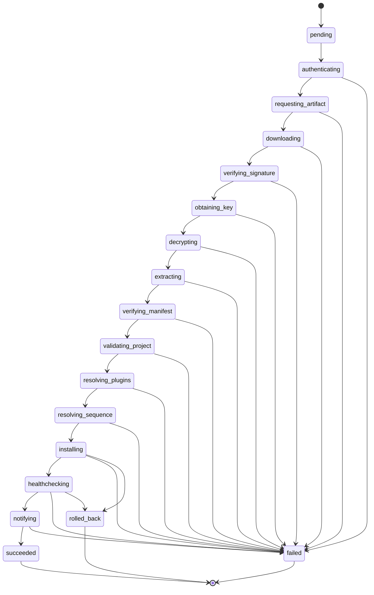
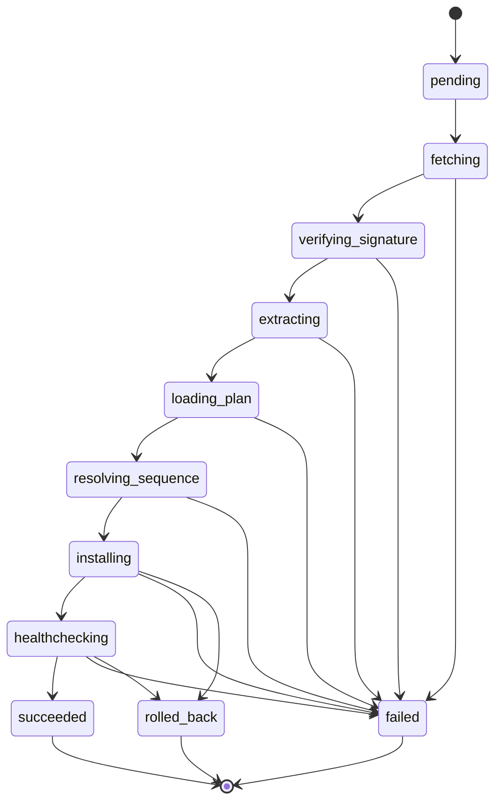

# Deployment pipelines

There are two deployment pipelines, one per Hub contract. Both are enforced
by explicit state machines, so a bug can't silently skip a security-relevant
step (e.g. installing before the artifact's signature has been verified).

## `.xdeploy` pipeline (`DeploymentRunner`)

Stage order is:

```
authenticate -> request_artifact -> download -> verify_signature ->
obtain_key -> decrypt -> extract -> verify_manifest -> validate_project ->
resolve_plugins -> resolve_sequence -> install -> healthcheck -> notify
```

### States



The transition table lives in `agent/state.py` (`TRANSITIONS`) and is
enforced by `DeploymentRunner._transition`. Every step between `PENDING` and
`INSTALLING` — signature verification, decryption, manifest verification,
project validation, plugin resolution — is mandatory; none can be skipped.

### Security-relevant guarantees

- `verify_signature` runs **before** `obtain_key`/`decrypt` — a tampered
  artifact is rejected before any key is ever used.
- `verify_manifest` re-checks the extracted content against the manifest's
  content hash, so extraction itself can't substitute files.
- `resolve_plugins` happens after the artifact is trusted — source-based
  plugin fetches never run against an unverified artifact.

## Marketplace pipeline (`MarketplaceDeploymentRunner`)

```
fetch -> verify_signature (HMAC) -> extract -> load_plan (local file) ->
resolve_sequence -> install -> healthcheck
```

### States



This state machine is deliberately **separate** from the `.xdeploy` one
(`agent/marketplace_state.py`). The real Marketplace flow has no auth
exchange, no DEK/decrypt step, and loads its install plan from a local
operator file instead of from inside the artifact — it is a materially
different sequence of security-relevant stages, not a subset of the
`.xdeploy` one.

### Differences from the `.xdeploy` pipeline

- **No DEK / no decryption** — the artifact is a plain ZIP.
- **Signature is HMAC-SHA256** (symmetric, shared secret) not Ed25519.
- **Plan is local** — `load_plan` reads `--install-plan` from the operator's
  host, never from the artifact.
- **Extra reporting step** — every run (success, failure, or rollback)
  calls `POST /deployments/report` (`X-API-Key` auth) after writing its
  local JSON report. This is intentionally best-effort: a Hub that's down
  never changes a deployment's outcome.

## Rollback

Both pipelines can roll back: `install` and `healthcheck` may transition to
`rolled_back`. `InstallDriver.rollback` restores the pre-install snapshot for
the failing step (or a specified earlier one), so a failed deploy leaves the
host on the previous known-good version.

## Notify / report

- `.xdeploy`: `DeploymentRunner._notify` sends `DeploymentReport` to the Hub
  via `POST /v1/deployments/report`.
- Marketplace: `MarketplaceDeploymentRunner._write_report` always writes a
  local JSON report; `_report_to_hub` then best-effort reports to
  `POST /deployments/report`.